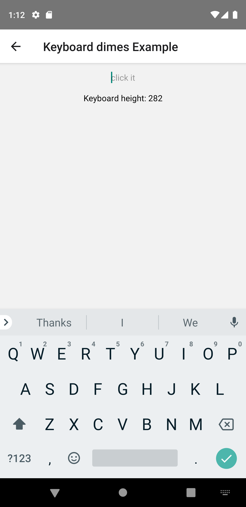
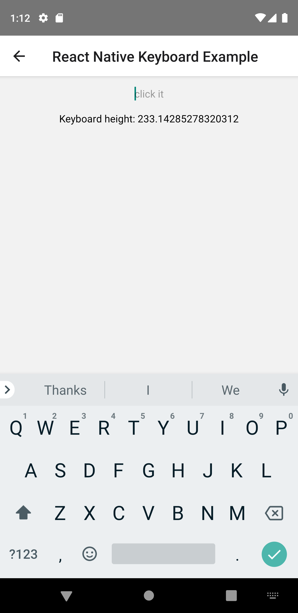

# react-native-keyboard-dimens

This repository contains two different ways to calculate keyboard height:
- custom implementation from [here](https://stackoverflow.com/a/62514321/15739252)
-  react native keyboard [api](https://reactnative.dev/docs/keyboard)

In keyboard api from react native, I noticed, that heigh for an open keyboard is incorrect, hence [keyboard header](https://github.com/ardaogulcan/react-native-keyboard-accessory) was under the keyboard. 
This [issue](https://github.com/ardaogulcan/react-native-keyboard-accessory/issues/49) has been reported in this repository, but it is caused by incorrect measured keyboard height  on some Android devices - [issue](https://github.com/facebook/react-native/issues/24353)

This issue only occur for an Android platform

## Example 

Correct height - custom solution

Incorrect height - react native keyboard api

## How to improve it 

https://twitter.com/chrisbanes/status/1230598177511788545

## Other solutions

https://github.com/Crysis21/KeyboardHeightProvider

## Contributing

See the [contributing guide](CONTRIBUTING.md) to learn how to contribute to the repository and the development workflow.

## License

MIT
